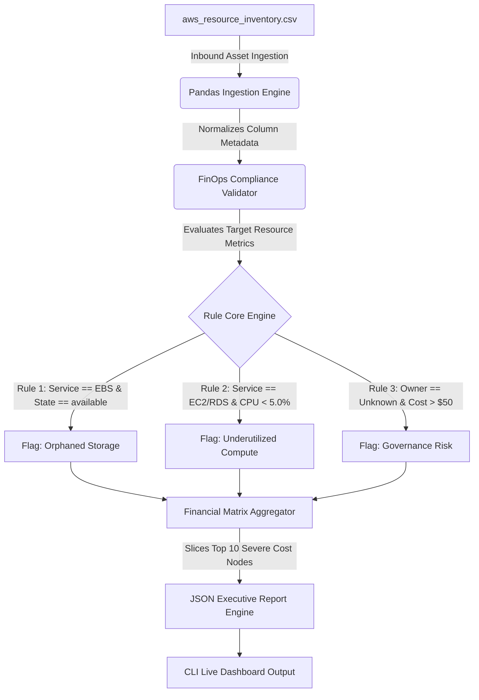
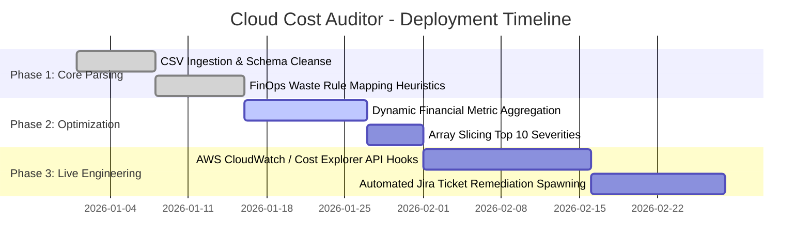

# tpm-toolkit

# Automated Enterprise Cloud Cost Auditor

An automated cloud governance and financial operations (FinOps) scripting pipeline designed to maximize cloud resource optimization. This project ingests enterprise-scale cloud infrastructure snapshots, aggregates run-rate metrics by environment tier and service line, identifies structural waste patterns, and automatically prioritizes the top 10 most critical remediation targets.

---

## Quick Overview for Recruiters (The Elevator Pitch)

*   **For Recruiters:** Large companies rent computer servers and storage space from the cloud (like Amazon AWS). When engineers finish a project, they often forget to turn those virtual servers off, or they rent a massive system that sits completely idle. This creates "financial leakage" costing companies millions. This tool acts as an automated financial auditor. It instantly scans a company's cloud footprint, calculates high-level monthly spending, and points out the exact 10 worst places where money is being wasted so a team can clean it up immediately.
*   **For Engineering Managers:** This is a programmatic FinOps telemetry tool engineered with Python and Pandas. The engine ingests un-normalized resource inventories, applies infrastructure optimization heuristics, and maps systemic waste nodes. It flags unattached storage blocks (`State == available`) and idle compute instances (`CPU_Utilization < 5.0%`). Instead of dumping raw data rows, it aggregates performance metrics dynamically to output a structured JSON corporate executive report.

---

## The Problem Statement

### Context
Managing modern, multi-tier cloud architectures (Production, Staging, Development, Sandbox) requires constant monitoring. Without strict governance, resource allocation footprints expand unchecked across diverse engineering disciplines.

### The Pain Point
Manual cloud infrastructure audits are highly reactive, and review cycles occur too late to prevent bill shock. Unattached storage volumes and over-provisioned, idling compute servers remain active indefinitely, driving massive financial waste and complicating visibility for technology leaders.

### The Objective
To design and build an automated, rule-based auditing engine that processes flat resource inventories (`aws_resource_inventory.csv`). The engine establishes clean cost-containment guardrails by automatically calculating gross run-rates, isolating severe leakage points, and streaming prioritized remediation directives.

---

## Technical Architecture

The auditing script operates as an extract-transform-report pipeline, processing flat infrastructure configurations into clean executive telemetry.



### Core Business Automation Heuristics
*   **Orphaned Storage Volumes:** Isolates Elastic Block Store (`EBS`) volumes operating independently of a virtual server. These volumes accrue active charges despite holding no connection vectors to running workloads.
*   **Underutilized Compute Nodes:** Targets idling virtual machines (`EC2` and `RDS`) consuming less than 5.0% total CPU usage. These represent severely over-provisioned systems that are prime targets for workload consolidation or downsizing.
*   **Unowned Cost Centers:** Catches governance anomalies where non-trivial spend records ($50+/month) completely lack ownership or engineering accountability tags, securing systemic budgeting oversight.

---

## Program Roadmap

The implementation timeline for this infrastructure cost containment framework spans three automated infrastructure steps:



*   **Phase 1: Foundation (Complete):** Established base input processors using Pandas. Built evaluation loops to catch untagged assets, disconnected storage, and idling computer nodes based on fixed usage baselines.
*   **Phase 2: Optimization (Current Sprint):** Transitioning raw outputs into prioritized data matrices. Added financial metrics by environment type and cloud service block, while grouping entries to display the top 10 execution paths.
*   **Phase 3: Production Integration (Next Up):** Replacing static inventories with direct, secure authentication vectors linking directly to live cloud provider endpoints. Designing webhook pipelines to automatically spawn Jira cleanup tickets assigned directly to account owners when waste thresholds breach targets.

---

## Cross-Functional Impact

This auditing engine bridges the gap between technical operations and financial governance by delivering a single source of truth:

| Workstream / Discipline | Operational Pain Point | Automated Engine Impact (The Value) |
| :--- | :--- | :--- |
| **Finance & FinOps Leads** | Cloud billing dashboards are confusing and lack direct technical accountability. | Translates dense resource tags into clear dollar metrics and structured optimization lists. |
| **Infrastructure / DevOps** | Cleaning up resources manually takes hours of system checking. | Pinpoints exactly which storage nodes can be safely deleted or compressed instantly. |
| **Engineering Managers** | Development environments expand unchecked and create budgeting issues. | Highlights exactly which specific developer workspaces are driving un-optimized costs. |
| **Executive Leadership** | Technology budgets are lost to hidden operational overhead. | Provides automated, immediate visibility to drive up to 30%+ efficiency gains. |

---

## Tech Stack & Setup

*   **Language:** Python 3.10+
*   **Data Analysis:** Pandas (For multidimensional structural sorting and data calculations)
*   **Configuration Handling:** Built-in JSON serialization libraries

### Quick Start
Ensure your project files are set up, then run the engine script in your terminal window:
```bash
# Navigate to the target cloud auditor working folder
cd Cloud\ Cost\ Auditor/

# Activate your central workspace virtual environment
source ../venv/bin/activate

# Execute the auditor engine
python3 src/cost_auditor.py
```

---

## Sample Report Output & Reviewer Walkthrough

When executed against a raw 100+ multi-tier cloud environment inventory, the script condenses the information and surfaces this clean, executive summary dashboard:

```json
{
  "financial_summary": {
    "gross_monthly_spend": 26425.24,
    "target_remediation_savings": 9734.0,
    "optimized_monthly_run_rate": 16691.24,
    "program_efficiency_gain_pct": 36.8,
    "total_detected_waste_nodes": 42
  },
  "breakdown_metrics": {
    "leakage_by_cloud_service": {
      "RDS": 5760.0,
      "EC2": 1168.0,
      "EBS": 565.0,
      "S3": 2241.0
    },
    "leakage_by_environment_tier": {
      "Production": 4325.0,
      "Staging": 1845.0,
      "Development": 2180.0,
      "Sandbox": 1384.0
    }
  },
  "top_10_critical_remediation_targets": [
    {
      "resource_id": "rds-db-analytics",
      "service_line": "RDS (Database)",
      "finding_category": "UNDERUTILIZED_COMPUTE_NODE",
      "monthly_leakage_amount": 890.0,
      "environment_tier": "Production",
      "accountable_team": "Marketing Analytics",
      "recommended_action": "Downsize instance family profile or consolidate workloads. Node is idling under 5% CPU capacity."
    }
  ]
}
```

### 🔍 How to Read This Output: A Walkthrough for Reviewers

1.  **The Financial Summary Block (The Bottom Line):** The auditor instantly tracks macro metrics. It captures a baseline monthly run-rate of **$26,425.24**, and flags that **$9,734.00** of that bill is structural waste. Remediating these files secures an immediate **36.8% efficiency gain** without impacting platform uptime.
2.  **The Breakdown Metrics Matrix:** The engine slices the waste numbers by category so a program manager knows where to look. It reveals that the **RDS (Database)** service line is the single biggest consumer of wasted spending ($5,760.00), and that **Production** is surprisingly leaking more money ($4,325.00) than non-production testing environments.
3.  **The Prioritized Action Items:** Instead of dumping an un-ordered list of 42 broken items, the script isolates the single highest-severity item first: `rds-db-analytics`. This database node alone represents nearly 10% of the entire program's target savings. The engine prints out clear instructions for operations: scale down this system profile immediately.

---

## TPM Core Competencies Demonstrated

*   **Data-Driven Fiscal Accountability:** Applied programmatic analytics architectures to manage and track enterprise technological spending patterns.
