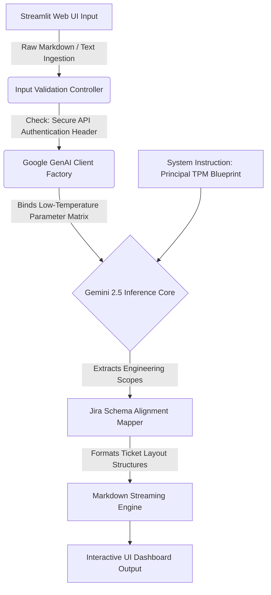
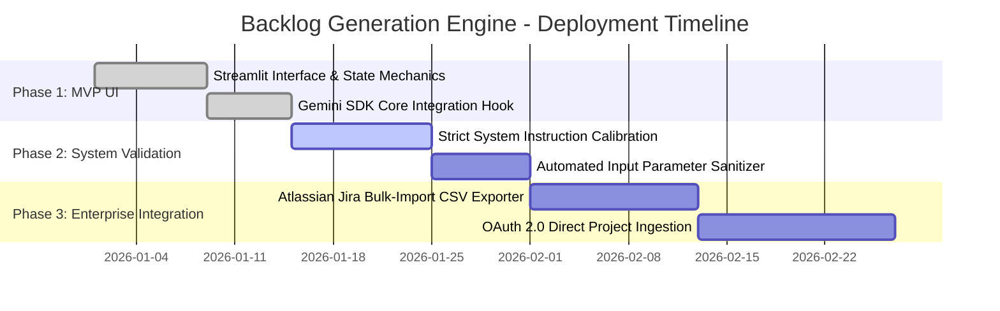

# tpm-toolkit

# Automated Agile Backlog Engine: PRD to Jira Story Generator

An automated requirement-scoping pipeline that programmatically transforms unstructured Product Requirement Documents (PRDs) into highly technical, ready-to-sprint Agile backlogs. This project combines human-centric product vision with system engineering metrics by wrapping Google's GenAI runtime client inside an interactive Streamlit operational dashboard.

---

## Quick Overview for Reviewers (The Elevator Pitch)

*   **For Recruiters:** When software products are built, product managers write long, text-heavy paragraphs describing what they want (the PRD). Engineers, however, need strict, bite-sized tasks with clear rules to actually code it. Bridging this gap manually takes a Technical Program Manager hours of tedious translation work. This tool automates that overhead. It securely pipes raw text through an optimized AI model acting as a TPM assistant, outputting out structured engineering tasks with concrete, measurable rules for success.
*   **For Engineering Managers:** This is an engineering scoping pipeline built with Python and Streamlit. It consumes raw text payloads, connects securely to the Google GenAI SDK using an encrypted-entry handshake, and prompts the `gemini-2.5-flash` model checkpoint. By passing hard engineering constraints via systemic instruction parameters and lowering model temperature to 0.2, it forces consistent, predictable syntax mapping across product specifications to eliminate engineering ambiguity.

---

## The Problem Statement

### Context
The transition window between product discovery (defining what to build) and engineering execution (building it) is a frequent source of friction in software programs. High-level feature definitions must be systematically decomposed into actionable execution items.

### The Pain Point
Manual transformation of extensive feature documents into developer tickets is highly time-consuming and error-prone. Critical edge-cases, system infrastructure dependencies, and precise validation metrics are frequently dropped or misaligned across team handoffs, causing scope creep and sprint delays.

### The Objective
To design and build an automated, self-service scoping workspace that programmatically interprets feature requirements. The tool applies a strict Principal TPM persona blueprint to enforce structural alignment across engineering ticket hierarchies, generating precise user stories and quantifiable criteria instantly.

---

## Technical Architecture

The transformation engine operates as a secure, decoupled input-to-inference application layout, piping raw feature data directly to isolated language pipelines.



### Core Token Constraints & Parsing Rules
*   **Persona Enforcement:** The model runs under strict system instructions, restricting responses to the mindset of an enterprise infrastructure engineer. It forces a complete rejection of marketing fluff.
*   **Deterministic Pattern Mapping:** Temperature parameters are calibrated to 0.2 to suppress model hallucinations, ensuring that ticket outputs conform cleanly to predefined operational schemas.
*   **Structural Acceptance Verification:** The parser mandates that every generated story must feature three explicit facets: a standard role-action-value user string, isolated system dependency flags, and ordered, objective verification checkboxes.

---

## Program Roadmap

The product lifecycle strategy for this generation workspace scales across three automated engineering blocks:



*   **Phase 1: Foundation (Complete):** Established core visual data components and text canvas views in Streamlit. Secured basic secure key variables and implemented inference connections to the primary GenAI client.
*   **Phase 2: Refinement (Current Sprint):** Calibrating precise context instructions to force strict format validation. Developing rule sanitizers to handle large, unstructured raw document copy blocks cleanly without breaking runtime limits.
*   **Phase 3: Production Scaling (Next Up):** Expanding output handlers to format data frames into compliant, schema-validated Jira bulk-import files. Building secure webhooks to directly write tickets to live enterprise instances via the Jira REST API.

---

## Cross-Functional Impact

This project provides an automated, self-service translation mechanism that creates immediate visibility for cross-team partners:

| Workstream / Discipline | Operational Pain Point | Automated Engine Impact (The Value) |
| :--- | :--- | :--- |
| **Product Management** | Writing extensive technical requirement specs creates delivery bottlenecks. | Accelerates the technical translation lifecycle from days to seconds with a single click. |
| **Engineering Teams** | Inheriting ambiguous user stories lacking clear technical context. | Provides immediate access to explicit technical dependencies and measurable boundaries. |
| **Quality Assurance (QA)** | Vague acceptance criteria forces manual guesswork when writing test cases. | Delivers ready-made, deterministic validation checklists to accelerate test case writing. |
| **Program Managers** | Spending hours cleaning up unformatted ticket trees to map program scopes. | Guarantees perfect architectural alignment across the backlog right from ticket creation. |

---

## Tech Stack & Setup

*   **Language:** Python 3.10+
*   **Web Framework:** Streamlit (For responsive browser view rendering)
*   **AI SDK Runtime:** Google GenAI (Interfacing with the gemini-2.5-flash model architecture)


### Quick Start & API Key Generation

#### 1. Obtain a Free Gemini API Key
To run the project, you need a connection vector to the Gemini platform framework:
1. Navigate to [Google AI Studio](https://google.com) and log in with any standard Google account.
2. Select the **Get API Key** button in the upper-left panel dashboard.
3. Click **Create API Key**, select an active project cluster, and copy the generated alphanumeric token string (prefixed with `AIzaSy`).

#### 2. Local Environment Execution Setup
Open your terminal application and execute these terminal commands sequentially:
```bash
# Navigate to the target project working folder
cd PRD\ to\ Jira/

# Activate your workspace virtual environment
source ../venv/bin/activate

# Install the package dependencies
pip install -r requirements.txt

# Securely inject your credential token into your environment memory
export GEMINI_API_KEY="your_copied_api_key_here"

# Run the local background web application server | enter your product requirements or source my sample in /data/mock_prd.md
streamlit run src/app.py
```

*Note: Alternatively, you can omit the `export` command and paste the key directly into the secure masked password field on the Streamlit browser UI sidebar at runtime. Keys are processed strictly in runtime memory and are never committed to the source file tree.*

---

## Sample Report Output

When provided with a raw functional text chunk, the automation engine streams clean markdown blocks formatted for instant code review:

```markdown
### Ticket ID: STORY-01
*   **Summary:** User Authentication Database Validation Layer
*   **User Story:** As an Enterprise Security Administrator, I want the authentication engine to validate credentials against the internal database and enforce strict login limits, so that malicious brute-force exposure vectors are mitigated.
*   **Technical Dependencies:** Requires configuration of the SQL Connection Pool and secure encryption layers on the password verification function.
*   **Acceptance Criteria:**
    1. System must complete database verification lookups within a maximum latency threshold of 200ms.
    2. Accounts must transition to a 'Locked' status state upon exactly the 3rd consecutive invalid password attempt.
    3. Transaction security logs must generate an audited metadata payload within 1 second of failure execution.
```

### How to Read This Output: A Walkthrough for Reviewers

This walkthrough explains how the engine successfully translates high-level product intent into granular, engineering-ready data blocks:

1. **`User Story` Schema Alignment:** Instead of a generic description, the engine forces the classic Agile template (*As a... I want to... So that...*). This ensures that developers understand exactly *who* the user is, *what* needs to be built, and *why* it matters to the business.
2. **`Technical Dependencies` Extraction:** Non-technical documents rarely call out infrastructure needs. The engine reads between the lines, identifying that this feature cannot launch without configuring the "SQL Connection Pool" and "encryption layers." A TPM uses this to map out cross-team schedule blocks before the sprint begins.
3. **Quantifiable `Acceptance Criteria` (The Definition of Done):** The tool completely eliminates ambiguous phrases like "the system should be fast" or "lock the user out safely." Instead, it enforces strict engineering metrics:
   * **Performance Testing:** It defines an explicit maximum latency boundary (**200ms**).
   * **Edge-Case Logic:** It specifies the exact trigger parameter (**exactly the 3rd consecutive attempt**).
   * **Security/Compliance:** It sets a definitive data logging time constraint (**within 1 second**).

### The Business Value (What This Proves to Recruiters)
This output demonstrates a deep understanding of software delivery lifecycle velocity. By using AI to automate the tedious parts of backlog creation, a TPM can shift their focus from writing basic tickets to solving architecture bottlenecks, aligning team swimlanes, and accelerating final launch timelines.


---

## TPM Core Competencies Demonstrated

*   **Process Architecture Automation:** Eradicated manual backlog overhead by leveraging AI platform frameworks as programmatic business accelerators.
*   **Strict Quality Governance:** Implemented explicit validation guardrails via systemic environment prompts, enforcing consistent documentation across cross-functional streams.
*   **Product-to-Engineering Orchestration:** Demonstrated the technical capability to break high-level business initiatives into clean, executable engineering swimlanes.
