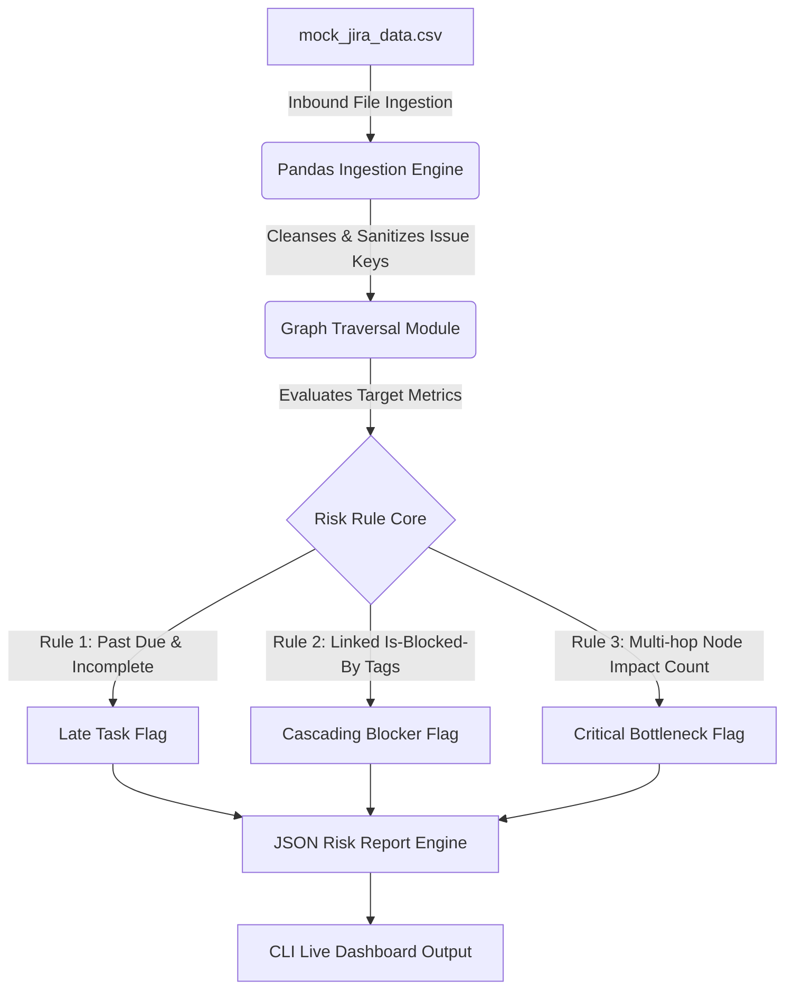
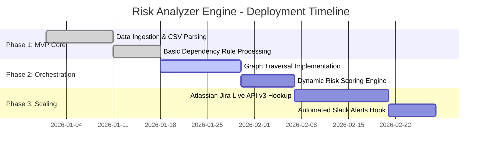

# tpm-toolkit

# Automated Program Risk & Dependency Analyzer

An automated risk-detection engine designed to manage critical-path dependencies and delivery velocity for high-stakes programs. This project applies production-grade enterprise governance architecture to a complex, multi-milestone wedding orchestration lifecycle (Initiative > Epic > Story).

---

## Quick Overview for Reviewers (The Elevator Pitch)

*   **For Recruiters:** Imagine managing a massive project where 20 different vendors are working at once. If the contract for the venue is signed late, it automatically creates a domino effect—the caterer can't plan food, the florist can't design layouts, and the invites can't ship. This tool is an automated "early warning system." It reads project data, automatically maps out those hidden connections, and flags exactly which items are about to stall before a disaster happens.
*   **For Engineering Managers:** This is a programmatic risk-triage pipeline. It ingests flat Jira issue exports, converts string-based issue links (`is blocked by`) into a directed dependency graph matrix, and runs graph-traversal logic to identify bottleneck, cascading impacts, and critical-path slippages using Python and Pandas - all items your TPM should be aware of.

---

## The Problem Statement

### Context
In scaled program management, tracking delivery across multiple independent workstreams becomes visually fractured. Critical-path visibility is frequently obscured by siloed status tracking, leaving hidden blockers buried deep within individual task updates.

### The Pain Point
Manual status extraction is highly reactive (e.g., waiting for someone to complain in a status meeting). Cross-team dependencies are typically discovered too late. This blind spot results in missed commitments, last-minute escalations, unmitigated budget risks, and compromised stakeholder trust.

### The Objective
To build an automated, data-driven Python engine that programmatically parses structured issue data (`mock_jira_data.csv`). The tool proactively isolates systemic bottlenecks, flags multi-hop cascading delays, and calculates program risk thresholds before they impact final delivery.

---

## Technical Architecture

The analytics engine processes program data, transforming unstructured dependency strings into a traversable data model.



### Core Logic & Risk Rules (How it works under the hood)
*   **Late Tasks:** Identifies execution tickets stuck in `To Do` or `In Progress` status while parent milestones are actively burning down.
*   **High-Risks:** Isolates jira tickets where the string `is blocked by` points to an upstream blocker. If **WED-101 (Venue Contract)** slips, the analyzer dynamically tracks and recalculates risk indices for 5 separate deliverables across 4 milestones.
*   **The Domino Effect Matrix:** Programmatically traces sequential dependencies. For instance, a delay in **WED-102 (Marriage License)** triggers a impact through **WED-402 (Printing)** $\rightarrow$ **WED-301 (RSVPs)** $\rightarrow$ **WED-202 (Headcount)** $\rightarrow$ culminating in a total blockage to **WED-701 (Master Day-of Timeline)**.

---

## Program Roadmap

The delivery strategy for this analytics engine is divided into three phased execution increments, tracking toward complete automation.



*   **Phase 1: Foundation (Complete):** Established core data schema modeling Agile Frameworks (Initiatives, Epics, and Stories). Built file handlers to parse parent-child hierarchies and standard issue metadata.
*   **Phase 2: Analytics Core (Current Sprint):** Developing graph-based relationship mappings to calculate multi-tier downstream impact scores. Transitioning plain-text reports into structured JSON metrics.
*   **Phase 3: Automated Integration (Next Up):** Replacing static CSV files with secure OAuth 2.0 connectors linking directly to live Jira Cloud instances, enabling real-time risk telemetry.

---

## Cross-Functional Impact

This engine transforms how diverse team disciplines collaborate by establishing unified, automated guardrails:

| Workstream | Operational Pain Point | Automated Engine Impact (The Value) |
| :--- | :--- | :--- |
| **Legal & Operations** | Delays in contracts and licenses stall creative work downstream. | Automatically notifies design and catering leads the moment a legal prerequisite slips. |
| **Logistics & Catering** | Headcounts and vendor layouts depend entirely on RSVP status. | Locks downstream purchasing workflows if invitations fail to ship on schedule. |
| **Design & Creative Directors** | Print assets and lighting grids stall without confirmed physical dimensions. | Surfaces single-point-of-failure constraints before print and build resources are wasted. |
| **Executive Leadership** | Overwhelmed by deep, unstructured task-level jira backlogs. | Supplies clean, multi-milestone high-level health telemetry for direct status reporting. |

---

## Tech Stack & Setup

*   **Language:** Python 3.10+
*   **Data Library:** Pandas (for matrix processing and relationship mappings)
*   **Visualizations:** Mermaid.js

### Quick Start
```bash
# Clone the repository
git clone https://github.com
cd sprint-risk-analyzer

# Run the analysis engine
python src/analyzer.py --file data/mock_jira_data.csv
```

---

## Sample Report Output

When executed, the script reads your data and formats a highly scannable summary report:

```json
[
  {
    "ticket_id": "WED-101",
    "summary": "Secure and sign venue contract",
    "risk_type": "CRITICAL_PATH_BOTTLENECK",
    "downstream_impact_count": 5,
    "impacted_milestones": ["WED-200", "WED-300", "WED-400", "WED-600"],
    "priority": "Highest",
    "mitigation_notes": "Single point of failure. 27% of total program stories are directly bottlenecked by this task."
  }
]
```

### How to Read This Output: A Walkthrough for Reviewers

This sample output demonstrates how the analyzer turns raw execution data into actionable program governance insight:

1. **`ticket_id` & `summary` (The Core Threat):** The engine isolates **WED-101 (Secure venue contract)**. While an engineer or coordinator might view this as just one open task, the analyzer flags it as a systemic risk.
2. **`risk_type: CRITICAL_PATH_BOTTLENECK`:** This is not a standard "late task" alert. The engine applies graph-traversal logic to identify that this specific node has a disproportionately high degree of dependency connections across the entire program ecosystem.
3. **`downstream_impact_count: 5`:** The tool instantly calculates the blast radius. A delay here does not just pause one workflow—it completely halts **5 separate downstream deliverables** across the timeline.
4. **`impacted_milestones` (Cross-Functional Impact Vectors):** The engine maps out the blast radius across team silos. It shows that stalling this single contract simultaneously breaks delivery timelines across four distinct operational milestones:
   * **WED-200:** Catering & Hospitality (Cannot finalize tastings)
   * **WED-300:** Vendor Logistics (Cannot finalize live band contracts)
   * **WED-400:** Design & Production (Cannot finalize florist table layouts)
   * **WED-600:** Guest Experience (Cannot secure hotel room blocks)
5. **`mitigation_notes` (TPM Executive Insight):** The script automatically calculates a program saturation metric: **27% of all active deliverables are sitting dead in the water** until this single task crosses the finish line. 

### The Business Value (What This Proves to Recruiters)
Instead of a Technical Program Manager asking every team for manual status updates during a status meeting, this output provides **instant operational telemetry**. It tells leadership exactly where to deploy resources or unblock dependencies to protect the final delivery date.


---

## TPM Core Competencies Demonstrated

*   **Algorithmic Critical-Path Modeling:** Transformed unstructured, string-based Jira data linkages into a traversable data model.
*   **Proactive Program Governance:** Replaced reactive status reporting with forward-looking risk modeling to surface delivery roadblocks on Day 2 of an operational cycle instead of Day 10.
*   **Cross-Functional Optimization:** Modeled complex cross-team workstreams (Logistics, Design, Catering, and Legal) to establish clear swimlanes and ownership accountability.
